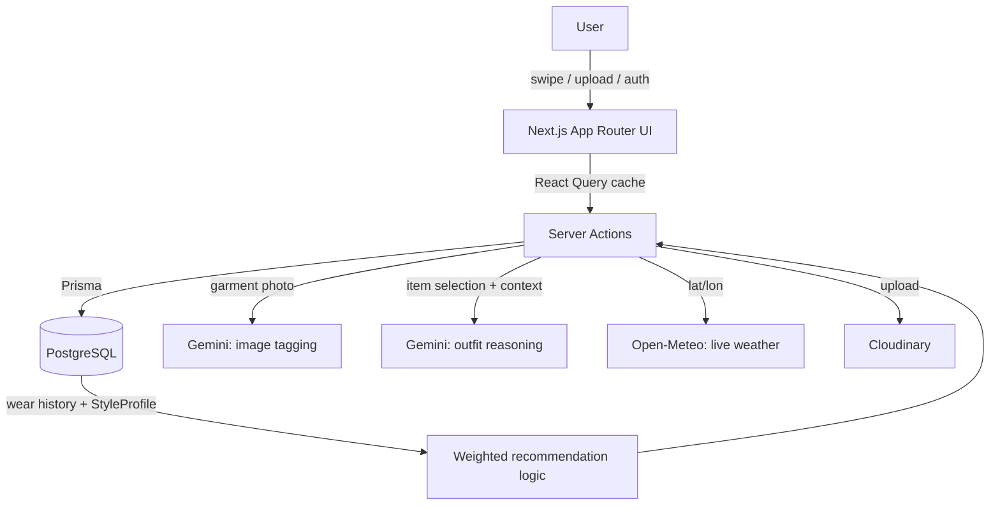

<div align="center">

# MUSE

### Decide less. Dress beautifully.

*An editorial, context-aware styling engine that maximizes the wardrobe you already own — not one more shopping feed.*

[](https://nextjs.org)
[](https://www.typescriptlang.org)
[](https://www.prisma.io)
[](https://tailwindcss.com)
[](https://ai.google.dev)
[](#license)

</div>

---

## Table of contents

- [The idea](#the-idea)
- [Features](#features)
- [Tech stack](#tech-stack)
- [Architecture](#architecture)
- [Project structure](#project-structure)
- [Getting started](#getting-started)
- [Environment variables](#environment-variables)
- [Deployment](#deployment-vercel)
- [Known limitations](#known-limitations)
- [License](#license)

---

## The idea

Every major fashion app competes on **inspiration volume** — more looks, more brands, more feed, more scroll. MUSE competes on the opposite axis: **decision compression**.

The user already owns clothes and already has a life. The entire product bet is collapsing "what do I wear" from a ten-minute anxious decision into a three-second confident one, using what's real in their closet — not what's aspirational in someone else's feed.

Three things have to hold for that to work without turning into another engagement trap:

1. **Competence over validation.** No ratings, no rankings, no comparison against other people.
2. **Trust compounds.** Every suggestion accepted without edits is a small proof the app understands the person — that's the retention mechanism, not a streak counter.
3. **Friction is the enemy.** The Daily Capsule should be the fastest decision in the user's morning.

No social feed, no streaks, no urgency/scarcity tactics on shopping suggestions — deliberately excluded because they'd contradict the thesis. Full product philosophy lives in [`MUSE_Product_Vision.md`](./MUSE_Product_Vision.md).

## Features

### 👗 Daily Capsule
Three outfit suggestions compiled fresh each day from your actual closet, real local weather, and an optional note about what your day looks like. Swipe right to accept, left to reject with a reason — each swipe teaches the system something.

### 📸 AI-powered closet tagging
Upload a garment photo and Google Gemini looks at the *actual image* — not a placeholder guess — to extract category, dominant color, season, and formality automatically. This is the highest-leverage part of onboarding: manual cataloguing is the #1 reason wardrobe apps get abandoned on day one.

### 🧭 Discover
Wardrobe gap insights, framed as insight rather than a sales funnel — flags what combinations your current closet *can't* make and why, with only enough product recommendation to bridge a real gap.

### 🧬 Style DNA
An evolving fingerprint of your style — relaxed↔structured, neutral↔bold, minimal↔maximal, heritage↔modern — computed from your closet composition and your accept/reject history over time.

### 🎯 Actually-weighted recommendations
Not `Math.random()`. Item selection weighs:
- **Wear recency** — pieces that have sat unworn longer get surfaced more.
- **Style DNA alignment** — formality choices lean toward your relaxed↔structured position.
- **Live weather** — cold or rainy conditions nudge outerwear and shoe choices, real temperature and precipitation via [Open-Meteo](https://open-meteo.com), not a hardcoded string.

## Tech stack

| Layer | Choice | Why |
|---|---|---|
| **Framework** | [Next.js 16](https://nextjs.org) (App Router, Turbopack, `proxy.ts` middleware) | Server Components keep the Daily Capsule's data fetch + AI reasoning off the client entirely — the swipe deck never waits on a client-side fetch. |
| **Language** | TypeScript | End-to-end type safety from the Prisma schema through to the UI. |
| **Auth** | [Auth.js v5](https://authjs.dev) (credentials + bcrypt) | Session handling with Node-runtime middleware, no third-party identity provider dependency. |
| **Database** | PostgreSQL via [Prisma ORM](https://www.prisma.io) | Wear-history and rejection-reasons are modeled as first-class data — that's what lets recommendations actually improve over time. |
| **AI reasoning + vision** | [Google Gemini](https://ai.google.dev) (`@google/genai`) | One model for both outfit-reasoning text generation and multimodal garment-photo tagging. |
| **Weather** | [Open-Meteo](https://open-meteo.com) | Free, no API key, cached 30 min per request. |
| **Image hosting** | [Cloudinary](https://cloudinary.com) | Garment photo storage and delivery. |
| **Client state** | [Zustand](https://github.com/pmndrs/zustand) | Swipe-deck UI state (current card, accepted outfit) — kept local so the core swipe interaction never lags on a network round-trip. |
| **Server-state caching** | [TanStack React Query](https://tanstack.com/query) | Caches outfit suggestions; speed is itself a trust signal, a slow suggestion reads as an unsure one. |
| **Styling** | Tailwind CSS v4 + [Framer Motion](https://www.framer.com/motion) | Editorial, typography-led visual language; spring/rotation physics on the signature swipe gesture. |

## Architecture



The recommendation logic in `actions/capsule.ts` is intentionally where the deepest investment goes — weather, calendar context, wear-recency, and Style DNA traits all feed into which 3 outfits get compiled each day, and the 3 Gemini reasoning calls run in parallel rather than sequentially to keep compile time down.

## Project structure

```
src/
  actions/               Server actions — the actual backend logic, one file per domain
    capsule.ts            Daily Capsule compiler (weighted selection) + accept/reject/regenerate
    wardrobe.ts            Closet CRUD
    discover.ts             Wardrobe gap analysis
    profile.ts               Style DNA computation
    context.ts                 Today's calendar-note input
    settings.ts                  User location capture (for weather)
  app/                    Routes (App Router)
    dashboard/             Today / Wardrobe / Discover / Style DNA — the 4-tab app shell
    auth/                   Login / signup
  components/
    dashboard/             DailyCapsule (swipe deck), ClosetGrid, DiscoverGrid, ProfileDNA, DashboardShell
    ui/                      Button, Card, Dialog, LivingBackground (canvas backdrop)
  lib/                    Thin wrappers around external services: prisma, auth, gemini, weather, cloudinary
  store/                  Zustand store for swipe-deck state
  providers/              SessionProvider + QueryClientProvider
prisma/
  schema.prisma           User, ClosetItem, Outfit, WearEvent, StyleProfile, DailyContext
```

## Getting started

**Prerequisites:** Node 20+, a PostgreSQL database ([Neon](https://neon.tech), [Supabase](https://supabase.com), [Railway](https://railway.app), or local).

```bash
npm install
cp .env.example .env
```

Fill in `.env` — see [Environment variables](#environment-variables) below — then:

```bash
npx prisma migrate dev --name init
npm run dev
```

Open `http://localhost:3000`, sign up, upload a few garment photos, and the Daily Capsule compiles on your first `/dashboard` visit.

## Environment variables

| Variable | Required | Notes |
|---|:---:|---|
| `DATABASE_URL` | ✅ | Postgres connection string. **On Supabase, use the pooled connection** (port `6543`, `?pgbouncer=true`) — the direct connection (port `5432`) opens a fresh handshake per serverless request and is the most common cause of slow page loads on Vercel. |
| `NEXTAUTH_SECRET` | ✅ | Generate with `openssl rand -base64 32` (or `node -e "console.log(require('crypto').randomBytes(32).toString('base64'))"` on Windows). |
| `NEXTAUTH_URL` | ✅ | `http://localhost:3000` locally; your real deployed domain in production. |
| `AUTH_TRUST_HOST` | production only | Set to `true` on Vercel — Auth.js v5 can't reliably auto-detect its host behind Vercel's proxy layer without it. |
| `GEMINI_API_KEY` | ✅ | Free key at [aistudio.google.com/app/apikey](https://aistudio.google.com/app/apikey). |
| `CLOUDINARY_URL` (or the 3 separate `CLOUDINARY_*` vars) | optional | [cloudinary.com](https://cloudinary.com) dashboard. Falls back to mock upload paths if unset — fine for local dev, not for a real deploy. |
| `DEFAULT_LAT` / `DEFAULT_LON` | optional | Fallback weather location until a user's browser grants geolocation. Defaults to Jaipur, India. |

## Deployment (Vercel)

1. Push to GitHub, import the repo in Vercel.
2. Set every variable from the table above in **Project → Settings → Environment Variables** — `.env` is gitignored and never travels with the deploy.
3. Confirm `DATABASE_URL` is the **pooled** Supabase connection string, not the direct one.
4. First deploy only: run `npx prisma migrate deploy` (not `migrate dev`) against the production database.
5. `package.json` already runs `prisma generate` via `postinstall` and before `next build` — required because Vercel caches `node_modules` and won't regenerate the Prisma client on its own otherwise.

## Known limitations

Deliberate scope decisions, not oversights:

- **Calendar is a manual text field**, not a real Google Calendar OAuth integration. Real OAuth (consent screen, token refresh, API quota) is meaningfully bigger scope — `actions/context.ts` is a clean seam to build that on later.
- **No email verification, password reset, or auth rate limiting.** Fine for a personal project/demo; needed before real users sign up.
- **No automated tests yet.**

## License

Not yet set — add one before making the repo public if you care about how others can use the code.

---

<div align="center">
<sub>Built with the thesis that the best fashion app is the one you open for three seconds and close.</sub>
</div>
